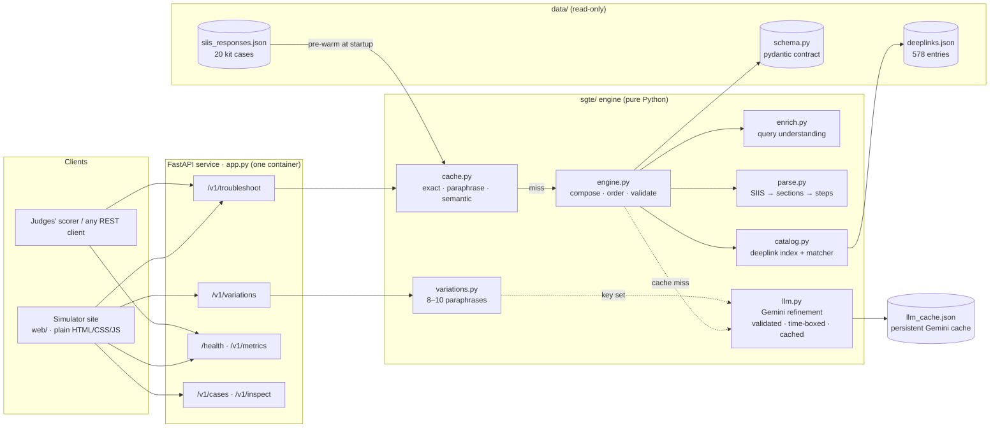

# Smart Guided Troubleshooting Engine (SGTE)

**PRISM Gen AI Hackathon 2026 · Theme 02 — Guided Troubleshooting**

SGTE turns a vague Galaxy device complaint and a Samsung SIIS knowledge article
into a structured, deeplinked troubleshooting plan. The plan has a goal, actions
ordered from least to most disruptive, one interaction per step, and deeplinks
that open the exact Settings screen and verify the fix.

```
POST /v1/troubleshoot
{ "query": "My Galaxy S22 screen turns blank…", "siis_response": { "title": "…", "content": "…" } }
→ ContextDeeplinkResponse (validated against the kit's schema.py) + meta {latency_ms, cache_hit, model, cost_usd}
```

## Architecture

### System view



### Request pipeline

The stages follow the Theme 2 guide's §2 pipeline:

```
Raw complaint (+ SIIS knowledge text)
  │
  ├─► [0] Query enrichment          sgte/enrich.py
  │       device model · first-mentioned symptom · fix vs how-to · keyword cache key
  │       8–10 paraphrases across registers (sgte/variations.py)
  │
  ├─► [1] Structure extraction      sgte/parse.py + sgte/engine.py
  │       headers / Step N: / "To …:" group labels / lists / prose → sections
  │       one Action per screen or feature · one physical interaction per step
  │       steps copied from the article, never invented (sgte/grounding.py checks)
  │
  ├─► [2] Deeplink mapping & ordering   sgte/catalog.py + sgte/engine.py
  │       exact on-screen label → catalogue entry, else BM25 with precision filters,
  │       else bixby://dummy_positive naming the screen; validation copied verbatim
  │       auto (Settings) → manual → escalations → critical (restart, reset, safe mode)
  │
  ├─► [2b] Gemini refinement (cache misses only)   sgte/llm.py
  │       topic for unfamiliar articles · "It will…" descriptions · closed-set pick for
  │       placeholder links · paraphrases; validated, 5 s budget, model fallback chain
  │
  ├─► [3] Fast-path semantic cache   sgte/cache.py
  │       hit  (< 1 ms): exact query, or a rewording about the same article
  │       miss: run [0]–[2], validate against schema.py, store
  │       no article sent: semantic lookup across pre-warmed scenarios
  │
  └─► [4] REST API service          app.py
          JSON body + meta {latency_ms, cache_hit, model, cost_usd}; fallback "no_match" / "no_siis_context"
```

### Request paths

```
POST /v1/troubleshoot
   │
   ├─ siis_response given ──► cache.lookup(query, SIIS hash)
   │        ├─ exact hit ───────────────► stored plan                          (~0.1 ms)
   │        ├─ paraphrase hit ──────────► stored plan, goal/title/score re-aimed (~1 ms)
   │        └─ miss ────────────────────► engine.troubleshoot() → store         (~2–7 ms)
   │                                        └─ no instructions in the article → {"contexts": [], "fallback": "no_match"}
   │
   └─ siis_response omitted ─► cache.lookup_query(query) across pre-warmed scenarios
            ├─ clear winner ────────────► that scenario's plan, re-aimed at the query
            └─ none ────────────────────► {"contexts": [], "fallback": "no_siis_context"}
```

### Components

| Guide pipeline component | Module | What it does | Engineering challenge handled |
|---|---|---|---|
| 0. Query enrichment | `sgte/enrich.py`, `sgte/variations.py` | Device, symptom (in the order the user mentions them), fix/how-to intent, normalised keyword key; 8–10 paraphrases | "My A16 went dark" and "blank display on galaxy a16" map to one scenario, so the cache doesn't fragment |
| 1. Structure extraction | `sgte/parse.py`, `sgte/engine.py` | Sections and labelled groups become actions (Title Case); compound sentences become one interaction per step | No hallucination: every step is a substring of the article; notes, link sentences and explainers are dropped |
| 2. Deeplink mapping & sequencing | `sgte/catalog.py`, `sgte/engine.py` | Exact-label index over all 578 entries (description names the page when messages are shared), label extension, open vs on/off vs set-a-value, rejection of neighbouring settings; auto → manual → critical ordering | Exact target screen, not the parent menu: "tap Storage, tap Clear cache" links *Clear cache* |
| 3. Fast-path caching | `sgte/cache.py` | Exact tier; paraphrase tier that reuses the article's plan; query-only semantic lookup | Rewordings hit (100% on unseen ones) and the answer equals a fresh run byte for byte |
| 4. REST API service | `app.py`, `Dockerfile` | `/v1/troubleshoot`, `/health`, variations, metrics, simulator endpoints; operational metadata | Never a 500 on odd input; one container serves the API and the simulator |

### Where Gemini fits

**Rules decide, Gemini refines.** The brief's hard requirements are steps from
the source text only, catalogue URIs copied verbatim, and answers under
300 ms. Those stay with rules and retrieval, which give 100% grounding, no
invented links and millisecond latency. The ablation in
[`metrics.md`](metrics.md) shows why: retrieval alone reaches the right entry
for only 66% of step-reachable catalogue entries, against 100% for the shipped
matcher. Gemini (`gemini-3.5-flash-lite`) handles what needs language
understanding:

| Stage | Gemini's job | Guardrail |
|---|---|---|
| `understand` | Names the topic of an article the symptom lexicon doesn't know; rewrites a query into a canonical form when the no-article lookup finds no clear match | 2–3 plain words, else the rules' name. Named from the article, not the query, so cached answers stay stable |
| `rerank` | For step groups the rules could only give a placeholder link, picks one entry from a shortlist of catalogue candidates, or none | Can't write a URI; an id outside the shortlist rejects the answer; the pick must name the screen the rules found and match the step's on/off |
| `describe` | "It will…" descriptions in plain language | 5–7 words, starts "It will", no URLs, no promised outcomes ("It will get help from your provider", not "fix") |
| `variations` | 8–10 paraphrases across registers | Merged with the deterministic set; unique; URL-free |

Steps are never model-written. Each request gets a 5-second Gemini budget, so
the cold path stays under the 8 s limit. On a 404, 429 or 5xx the next model is
tried (`gemini-3.1-flash-lite`). Anything invalid, late or failed leaves the
rules' answer. Gemini runs only on cache misses: hits never call it, so repeats
stay around 1 ms and $0.

Results are **persisted** in `data/llm_cache.json` (guide Phase 3: "persistent
local caching with pre-computed query variations"). `scripts/warm_llm_cache.py`
fills it, and it's committed. So the deployed API, local runs, the tests (which
never touch the network) and `results.jsonl` all give identical answers, with or
without a key, and startup makes no burst of calls. Every response's `meta`
reports `model`, `llm_calls` and `cost_usd` (from real token counts); `/v1/metrics`
shows the totals.

## Theme 2 guide compliance

| Guide requirement | How SGTE meets it |
|---|---|
| Goal: `Follow these steps to perform this <Topic> Troubleshooting` (or `Configuration`) | Topic from the article, else the user's symptom. Fix-type queries get *Troubleshooting*; how-to queries get *Configuration*. No trailing period, as in the guide's syntax and both official examples |
| Title 2–3 words, sentence case | `Blank screen`, `Email connection`, `SIM card detection` |
| actionName Title Case; one screen/feature per action | "To clear the app's cache:" and "To clear the app's data:" become two actions |
| Description: 5–7 words, starts "It will" | Built from the action's verb and fitted to length |
| Steps: imperative, one physical interaction each | "Navigate to Settings, tap Display, and then tap Screen timeout." → three steps. Pieces stay substrings of the article |
| `auto`: Settings screen reachable by deeplink | Every step group carries a deeplink |
| `critical`: disruptive or irreversible (factory reset, restart, firmware update, safe mode), ordered last | Also clearing data, reset network settings and safety hazards (swelling, liquid damage) |
| `manual`: physical interventions, no actionable deeplink | Enforced. A section mixing linked and unlinked groups is split |
| Order: least disruptive first | auto → manual → escalations (contact support / service centre) → critical |
| Zero URL leaks; catalogue integrity | URLs, link sentences and HTML stripped; deeplinks copied exactly; validation copied with `value` as a string |
| No viable solution → `contexts: []` + `"fallback": "no_match"` | Articles with no instructions (e.g. "What are Bixby Routines?") |
| `siis_response` omitted → semantic lookup against pre-warmed entries | `cache.lookup_query`, else `"fallback": "no_siis_context"` |
| Operational metadata (latency, hit flag, cost) | `meta` in every body (Appendix B) plus `X-Cache`, `X-Cache-Hit`, `X-Latency-Ms`, `X-Cost-Usd` headers |
| `query_variations`: 8–10 across formal, casual, keyword-only, frustrated, typo-inclusive | All five styles in every set, plus question and support-ticket phrasings |
| Appendix B worked example (swipe navigation) | Reproduced as a test: same goal, title, action name and first steps. It links the real catalogue entry *View Navigation bar* where the guide's example used a placeholder |
| Appendix C `metrics.md` report | Generated from real runs by `scripts/metrics_report.py`, including the ablation |

## Results

`python scripts/local_score.py` (in-process) or `--url http://host:port` (live).
Numbers below are from the live server:

| Check | Result | Threshold |
|---|---|---|
| G2 `/health` | `{"status":"ok"}` | 200 + ok |
| G3 coverage | 20/20 (100%) | ≥ 95% |
| G4 schema-valid | 20/20 (100%) | ≥ 90% |
| G5 URL leaks | 0 | 0 |
| A1 format rules (goal, 2–3-word title, "It will…" 5–7 words, score 0–1) | 100% clean | — |
| A2 deeplinks: in catalogue / auto actions with a link | 100% / 100% | — |
| A3 repeat p95 / hit rate | 0.8 ms / 100% | ≤ 300 ms / ≥ 90% |
| A3 paraphrase hit (hand-written, never pre-warmed) | 16/16 (100%) | ≥ 80% |
| A3 cold p95 | ~4 ms | ≤ 8 s |
| A4 unseen formats (lists, HTML, ALL-CAPS, explainer-only, one-liners): correct / grounded steps | 14/14 · 74/74 | — |
| A5 variations: 8–10 per query / mean pairwise Jaccard | 100% / 0.32 | 8–10, diverse |
| **Step grounding** (every step found in the SIIS text) | **349/349 (100%)** | no invented steps |
| **Cost per query** | **$0.00** | — |

The point totals the script prints are our own estimate of the rubric, used to
catch regressions. They are not the official score. The full Appendix C
report, with step accuracy (2.91/3), deeplink relevance (2.00/2), latency for
each path at N ≥ 30, and the ablation, is in [`metrics.md`](metrics.md).
