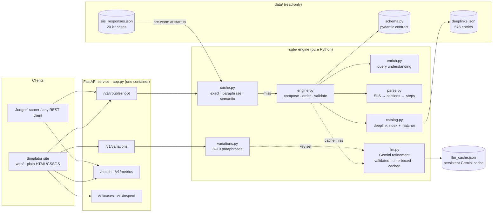

# Smart Guided Troubleshooting Engine (SGTE)

**PRISM Gen AI Hackathon 2026 · Theme 02 — Guided Troubleshooting**

SGTE turns a vague Galaxy device complaint and a Samsung SIIS knowledge article
into a structured, deeplinked troubleshooting plan. The plan has a goal, actions
ordered from least to most disruptive, one interaction per step, and deeplinks
that open the exact Settings screen and verify the fix.

```
POST /v1/troubleshoot
{ "query": "My Galaxy S22 screen turns blank…", "siis_response": { "title": "…", "content": "…" } }
→ ContextDeeplinkResponse (validated against the kit's schema.py) + meta {latency_ms, cache_hit, model, cost_usd}
```

## Architecture

### System view



### Request pipeline

The stages follow the Theme 2 guide's §2 pipeline:

```
Raw complaint (+ SIIS knowledge text)
  │
  ├─► [0] Query enrichment          sgte/enrich.py
  │       device model · first-mentioned symptom · fix vs how-to · keyword cache key
  │       8–10 paraphrases across registers (sgte/variations.py)
  │
  ├─► [1] Structure extraction      sgte/parse.py + sgte/engine.py
  │       headers / Step N: / "To …:" group labels / lists / prose → sections
  │       one Action per screen or feature · one physical interaction per step
  │       steps copied from the article, never invented (sgte/grounding.py checks)
  │
  ├─► [2] Deeplink mapping & ordering   sgte/catalog.py + sgte/engine.py
  │       exact on-screen label → catalogue entry, else BM25 with precision filters,
  │       else bixby://dummy_positive naming the screen; validation copied verbatim
  │       auto (Settings) → manual → escalations → critical (restart, reset, safe mode)
  │
  ├─► [2b] Gemini refinement (cache misses only)   sgte/llm.py
  │       topic for unfamiliar articles · "It will…" descriptions · closed-set pick for
  │       placeholder links · paraphrases; validated, 5 s budget, model fallback chain
  │
  ├─► [3] Fast-path semantic cache   sgte/cache.py
  │       hit  (< 1 ms): exact query, or a rewording about the same article
  │       miss: run [0]–[2], validate against schema.py, store
  │       no article sent: semantic lookup across pre-warmed scenarios
  │
  └─► [4] REST API service          app.py
          JSON body + meta {latency_ms, cache_hit, model, cost_usd}; fallback "no_match" / "no_siis_context"
```

### Request paths

```
POST /v1/troubleshoot
   │
   ├─ siis_response given ──► cache.lookup(query, SIIS hash)
   │        ├─ exact hit ───────────────► stored plan                          (~0.1 ms)
   │        ├─ paraphrase hit ──────────► stored plan, goal/title/score re-aimed (~1 ms)
   │        └─ miss ────────────────────► engine.troubleshoot() → store         (~2–7 ms)
   │                                        └─ no instructions in the article → {"contexts": [], "fallback": "no_match"}
   │
   └─ siis_response omitted ─► cache.lookup_query(query) across pre-warmed scenarios
            ├─ clear winner ────────────► that scenario's plan, re-aimed at the query
            └─ none ────────────────────► {"contexts": [], "fallback": "no_siis_context"}
```

### Components

| Guide pipeline component | Module | What it does | Engineering challenge handled |
|---|---|---|---|
| 0. Query enrichment | `sgte/enrich.py`, `sgte/variations.py` | Device, symptom (in the order the user mentions them), fix/how-to intent, normalised keyword key; 8–10 paraphrases | "My A16 went dark" and "blank display on galaxy a16" map to one scenario, so the cache doesn't fragment |
| 1. Structure extraction | `sgte/parse.py`, `sgte/engine.py` | Sections and labelled groups become actions (Title Case); compound sentences become one interaction per step | No hallucination: every step is a substring of the article; notes, link sentences and explainers are dropped |
| 2. Deeplink mapping & sequencing | `sgte/catalog.py`, `sgte/engine.py` | Exact-label index over all 578 entries (description names the page when messages are shared), label extension, open vs on/off vs set-a-value, rejection of neighbouring settings; auto → manual → critical ordering | Exact target screen, not the parent menu: "tap Storage, tap Clear cache" links *Clear cache* |
| 3. Fast-path caching | `sgte/cache.py` | Exact tier; paraphrase tier that reuses the article's plan; query-only semantic lookup | Rewordings hit (100% on unseen ones) and the answer equals a fresh run byte for byte |
| 4. REST API service | `app.py`, `Dockerfile` | `/v1/troubleshoot`, `/health`, variations, metrics, simulator endpoints; operational metadata | Never a 500 on odd input; one container serves the API and the simulator |
