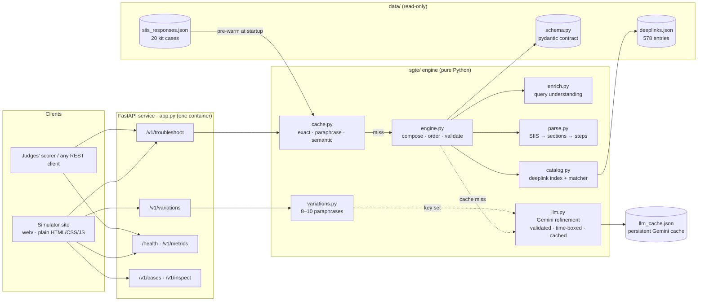

# Smart Guided Troubleshooting Engine (SGTE)

**PRISM Gen AI Hackathon 2026 · Theme 02 — Guided Troubleshooting**

SGTE turns a vague Galaxy device complaint and a Samsung SIIS knowledge article
into a structured, deeplinked troubleshooting plan. The plan has a goal, actions
ordered from least to most disruptive, one interaction per step, and deeplinks
that open the exact Settings screen and verify the fix.

```
POST /v1/troubleshoot
{ "query": "My Galaxy S22 screen turns blank…", "siis_response": { "title": "…", "content": "…" } }
→ ContextDeeplinkResponse (validated against the kit's schema.py) + meta {latency_ms, cache_hit, model, cost_usd}
```

## Architecture

### System view


